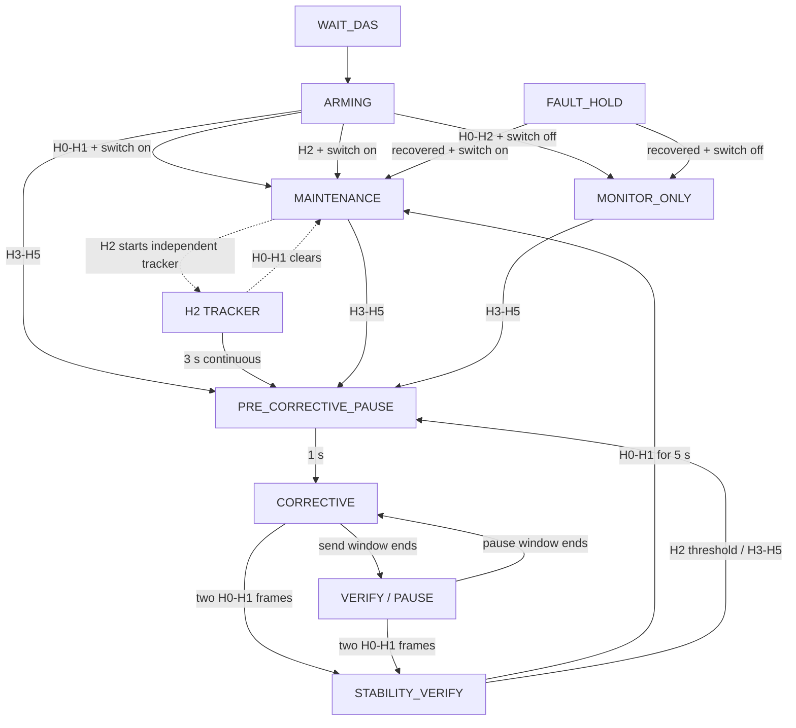

# Adaptive NAG closed-loop operation and validation

This document defines the V5.0-V13 adaptive NAG operating boundary for the Waveshare ESP32-S3 WiFi-NAG target. The vehicle baseline is Model Y HW4 on vehicle software `2026.2.11`, using the Party CAN tap pins 2/3 at `500 kbit/s`. The V5.0 layered-timer and configurable-polarity changes have not completed vehicle validation; results from any earlier baseline must not be generalized into a cross-vehicle or cross-version guarantee.

## Safety boundary and CAN roles

Start every installation and bus change with NAG disabled and `CAN Write OFF`. In listen-only mode, capture at least 10 minutes and confirm that the same physical CAN tap receives both IDs below. If either ID is absent, do not enable adaptive TX: that tap does not provide the feedback needed by this controller.

| CAN ID | Role | Read/write boundary |
|---|---|---|
| `0x370 / 880` | OEM EPAS torque, angle, and counter input; source template for the NAG echo | Only checksum-valid, non-own-echo OEM frames update direction/timing and may trigger a counter+1 echo. Maintenance and legacy output are clamped to `[-180,+180] cNm`; corrective output is independently clamped to `[-250,+250] cNm`. The checksum is recalculated. |
| `0x39B / 923` | DAS Hands-On State (HOS), from byte 5 bits `[5:2]` | Strictly read-only. It is parsed and observed but never copied, modified, or sent. |

The controller does not treat a successful local `driver.send()` as proof that DAS accepted the action. It also does not transmit when an OEM frame is malformed, reserved, checksum-invalid, or identified as this device's own echo.

## HOS policy

| HOS | Meaning | Adaptive action |
|---:|---|---|
| `0` | NOT_REQD | With maintenance enabled, continuously inject `1.50..1.80 Nm` by default. With maintenance disabled, monitor only. |
| `1` | REQD_DETECTED | Same maintenance/monitor-only policy as H0. |
| `2` | REQD_NOT_DETECTED | Continue preventive injection while timing continuous H2. At the default 3 s threshold, stop all adaptive output for 1 s and enter correction. H0/H1 resets the timer. |
| `3` | VISUAL | Skip the H2 timer, stop all adaptive output for the configured reset pause, then enter a default 3 s bipolar correction window with `1.80..2.40 Nm` peaks. |
| `4` | CHIME_1 | Same pulsed corrective action as H3. |
| `5` | CHIME_2 | Same pulsed corrective action as H3. |
| `6` | SLOWING | Stop sending and enter fail-closed protection hold. |
| `7` | STRUCK_OUT | Stop sending and enter fail-closed protection hold. |
| `8` | SUSPENDED | Stop sending and enter fail-closed fault hold. |
| `9..14` | Undefined | Stop sending and enter fail-closed fault hold. |
| `15` | SNA | Stop sending and enter fail-closed fault hold. |

## State machine

`WAIT_DAS` requires fresh valid `0x39B`. `ARMING` requires three valid OEM `0x370` frames. With maintenance enabled, `MAINTENANCE` injects a `1.50..1.80 Nm` target on valid OEM frames. Preventive rest defaults to `0/0`, so the injection is continuous; a non-zero range restores the optional activity/rest cycle. With maintenance disabled, `MONITOR_ONLY` emits nothing during HOS `0..2`. `WAIT_DAS` and `FAULT_HOLD` also do not send.

Continuous H2 starts an independent tracker while the existing preventive activity/rest substate and its deadline continue unchanged. H0/H1 cancels the tracker; at the configurable threshold (default 3 seconds), `PRE_CORRECTIVE_PAUSE` sends nothing for a default 1 second. H3..H5 enters the same reset pause without waiting for H2. Repeated H3..H5 frames do not restart this pause.

Maintenance starts at a magnitude inside its configured sign-specific range. Each successful echo moves the magnitude by exactly `1 cNm`; the sweep reverses at either boundary. A failed send does not advance it.

Adaptive direction comes only from steering-wheel angle: above `+1.0 deg` selects negative injection, below `-1.0 deg` selects positive injection, and the center band retains the last direction. A cold start in the center band has no direction and sends nothing. Absolute angle above `50.0 deg` blocks adaptive output; exact `+/-50.0 deg` is allowed. Observed OEM torque is diagnostic only.

Correction chooses its first sign from the angle-derived or retained direction. With both frame counts nonzero, negative and positive sweeps alternate; changing polarity uses exactly 10 successful transition echoes and these transition frames do not consume either configured side count. With one frame count equal to zero, that side is disabled and the other sign remains fixed. With both counts zero, corrective output is disabled while monitoring remains active. Each enabled side defaults to 100 successful frames and follows a triangle from its configured minimum to a selected sign-specific peak and back to its minimum; a failed send does not advance the frame. `VERIFY` is a true no-send pause and preserves sign, frame, peak, and transition state so the next sending window resumes from the same position. H2 does not exit correction; two consecutive fresh H0/H1 frames are required. This recovery loop has no attempt limit.

Sending is immediate and event-driven: each valid checksum/DLC-correct, non-own OEM `0x370` frame is evaluated once and may produce at most one immediate Counter+1 echo. There is no delayed scheduler, minimum corrective send interval, retry, or extra timer-generated `0x370`.

## Defaults and configuration limits

| Parameter | Default | Configurable boundary | Notes |
|---|---:|---:|---|
| H0-H1 maintenance | Enabled | On/off | When off, H0-H2 is monitor-only; H3-H5 correction remains active. |
| Preventive negative magnitude | `1.50..1.80 Nm` | `1.50..1.80 Nm` | Selected when steering-wheel angle is positive or that direction is retained. |
| Preventive positive magnitude | `1.50..1.80 Nm` | `1.50..1.80 Nm` | Selected when steering-wheel angle is negative or that direction is retained. |
| Corrective negative magnitude | `1.80..2.40 Nm` | `1.80..2.50 Nm` | Selected per negative triangle. |
| Corrective positive magnitude | `1.80..2.40 Nm` | `1.80..2.50 Nm` | Selected per positive triangle. |
| Corrective negative frames | `100` | `0` or `10..255` | Zero disables negative correction; otherwise successful sends per negative triangle. |
| Corrective positive frames | `100` | `0` or `10..255` | Zero disables positive correction; otherwise successful sends per positive triangle. Both zero disable corrective sending. |
| Angle direction threshold | `+/-1.0 deg` | Fixed | Outside the center band selects the opposite torque sign; inside it retains the last direction. |
| Angle send limit | `+/-50.0 deg` | Fixed | Absolute angle above this value blocks adaptive output; exact endpoints remain allowed. |
| Preventive activity window | `2.0..3.0 s` | `0.1 s..uint32 ms max` | Every valid OEM frame is eligible. |
| Smooth release | Retained for API compatibility | `0.1..1.0 s` | Not used by the pulsed policy. |
| Preventive no-send interval | `0/0 s` | `0/0` or `0.1 s..uint32 ms max` | Both zero disable rest; a non-zero range emits no additional `0x370` during rest. |
| H2 persistence | `3.0 s` | `0..uint32 ms max` | Zero triggers recovery on the first fresh H2 observation. |
| Pre-correction reset pause | `1.0 s` | `0..uint32 ms max` | Zero skips the reset pause. |
| Corrective send window | `3.0..3.0 s` | `0.1 s..uint32 ms max` | H3..H5 only; bipolar triangles repeat until the window ends. |
| Corrective no-send interval | `1.0..2.0 s` | `0/0` or `0.1 s..uint32 ms max` | Both zero disable the pause. |
| H0/H1 stability verification | `5.0 s` | `0..uint32 ms max` | Zero accepts recovery immediately. |
| DAS freshness timeout | `750 ms` | `100..2000 ms` | Allows margin for the observed ~500 ms DAS broadcast interval; stale feedback immediately returns to `WAIT_DAS`. |
| EPAS gap rearm | `200 ms` | Fixed | A longer gap requires three valid OEM frames again. |
| Fault recovery | HOS `0..2` for `2000 ms` | Fixed | Toggling NAG off and on also resets the controller. |
| Maintenance/legacy torque clamp | `+/-1.80 Nm` | Cannot be raised | Applied immediately before encoding non-corrective echoes. |
| Corrective torque clamp | `+/-2.50 Nm` | Cannot be raised | Applied only to HOS `3..5` corrective echoes. |

Preventive magnitude and corrective frame state advance only after successful sends. For API requests, only omitted fields retain their previous values. Every provided field must be finite, fully parsed, inside its safety boundary, and preserve min/max ordering; zero-disable ranges require both endpoints to be zero. Otherwise the entire request returns HTTP 400 without publishing a command or changing NVS.

## Fail-closed behavior

- Missing or stale DAS feedback: stop sending and enter `WAIT_DAS`; do not substitute local send success for DAS freshness.
- HOS `6..15`: stop immediately and enter `FAULT_HOLD`.
- NAG switch off: disable and reset the adaptive controller; no adaptive frame is requested.
- `CAN Write OFF`: the driver blocks physical CAN transmission. Keep it off for listen-only validation and whenever safe behavior is uncertain.
- CAN error, bus-off, unexpected steering behavior, or an FSD state anomaly during controlled validation: turn `CAN Write OFF` and stop the session.

The controller may recover from fault hold only after fresh HOS `0..2` remains continuous for `2000 ms`, or after the operator explicitly cycles NAG off/on. Unknown, corrective, rejected, or stale DAS input resets the recovery interval.

## Telemetry: local TX is not DAS acknowledgement

| Layer | Fields | Interpretation |
|---|---|---|
| Local attempt | `nagSendAttempts` | The handler called the CAN driver for an eligible echo. This is not evidence of bus delivery or DAS acceptance. |
| Local failure | `nagSendFailures` | The driver rejected/failed an attempted send. The current correction window continues while HOS is `3..5`; scheduled 1..2-second no-send intervals still occur. |
| Local success | `nagEcho` and last injected torque/age | The driver accepted the echo locally. It is still not a DAS acknowledgement. |
| DAS response | `nagAcknowledgementCount`, last/max latency | Two consecutive fresh H0/H1 observations ended correction. |

Counter collision count and last gap are timing evidence only. They do not change scheduling and must not be hidden or redefined to improve a reported ratio.

## WebUI behavior

The custom-policy page has five policy sections:

1. Preventive layer: default-on H0-H1 maintenance switch and independent negative/positive min/max magnitude.
2. Corrective layer: independent negative/positive min/max magnitude and per-side frame count; zero disables that side and disables its magnitude inputs.
3. Preventive timing: optional activity/rest cycle, with rest disabled by default using `0/0`.
4. Recovery handoff: configurable H2 persistence, pre-correction reset pause, and H0/H1 stability verification.
5. Corrective timing: independently configurable send/pause windows, defaulting to 3 seconds and 1..2 seconds.
6. Safety boundary: read-only correction-only `+/-2.50 Nm` hard cap, `750 ms` recommended DAS timeout, angle-direction mapping, the `+/-1.0 deg` hold band, the strict `>50.0 deg` stop gate, and the one-echo-per-OEM rule.

Editing an input changes only the browser draft and shows an unsaved indicator. Restore recommended values loads the documented defaults into that draft and also remains unsaved. Only Save custom policy POSTs the normalized draft and persists it; success reloads the normalized response and clears dirty state, while failure preserves the unsaved draft.

When preventive rest is `0/0`, the activity inputs are disabled with the hint `当前持续注入；启用停发后生效`. Turning maintenance off disables preventive torque, activity/rest, H2, and pre-correction-pause controls without disabling correction controls. Hidden retained release fields are not submitted by the browser.

The closed-loop diagnostic panel separates four evidence layers: original OEM/DAS input, controller decision, local send, and DAS response. It exposes the preventive substate, independent H2 tracker, corrective mode, and polarity-transition progress so overlapping timers are not mislabeled as one phase. Its browser-local event timeline records only changes to DAS freshness, HOS, phase, acknowledgements, and counter collisions; it keeps the newest 20 entries. Clearing it does not reset device counters.

Color semantics are strict: green means fresh/READY/DAS acknowledgement; yellow means release/rest/verify/collision; red means stale/fault/send failure; gray means disabled or unseen. Local send success is never colored as DAS acceptance.

The dedicated `/api/nag-adaptive` diagnostic poll runs only while the diagnostics page is active, system monitoring is enabled, and the document is visible. Its interval is `500 ms` in a normal browser and `1000 ms` in Car UI or network-performance mode. Leaving the page, disabling monitoring, hiding the document, or stopping dashboard polling clears the timer. This poll updates only NAG diagnostics and does not trigger Wi-Fi, BLE, DNS, or system-status requests.

## Rollback and stop procedure

Switching to `MODE_A` is allowed only as a short diagnostic check that the legacy fixed `+1.80 Nm` behavior still exists. `MODE_A` sends on every valid OEM frame and is not a safety downgrade or fail-safe mode.

To stop CAN writes, disable NAG and turn `CAN Write OFF`. Do not use a mode change as a substitute for disabling writes. Revision 11 removes the retired timing keys and conditionally migrates only exact former defaults; custom torque, frame-count, and pause values are preserved. V5.0-V13 does not read the retired timing settings as adaptive policy.

## Validation ladder

Gate A is the automated delivery-candidate gate: full Python discovery, generated-UI check, every configured native environment including the deterministic 100,000-sequence safety matrix, and the ESP32-S3 OTA build plus image-integrity checks must pass. The OTA artifact is `.pio/build/wifi_nag_ESP32_S3_CAN/firmware.bin`.

Gate B is not automated and must not be claimed from a build. It requires at least 10 minutes of listen-only data from the exact vehicle/tap/software combination, both CAN IDs, interval statistics, and a manually observed HOS mapping.

Gate C is not automated and must not begin until Gates A and B pass. It is limited to a closed course with immediate takeover capability: first five preventive windows, then at most three deliberate HOS `3..5` events, with local TX, HOS, warning-clearance latency, and collision evidence captured. Hardware validation, flashing, road testing, and release publication are outside this delivery-candidate build.
