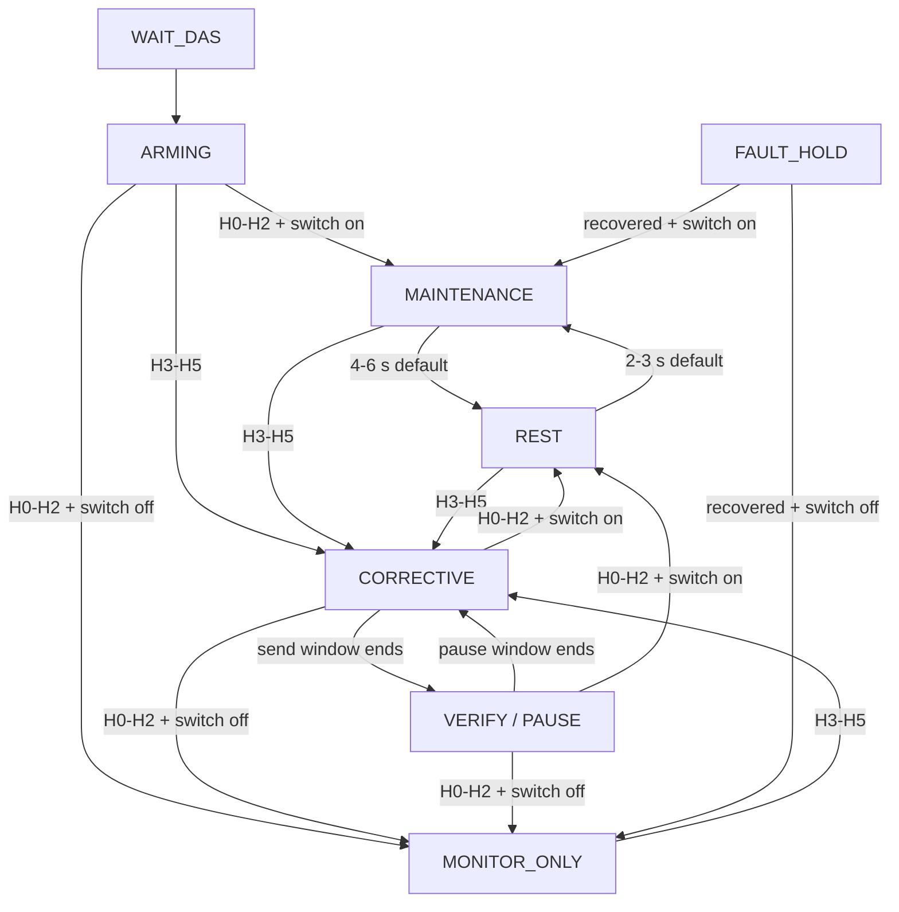

# Adaptive NAG closed-loop operation and validation

This document defines the V4.6-V13 adaptive NAG operating boundary for the Waveshare ESP32-S3 WiFi-NAG target. The vehicle baseline is Model Y HW4 on vehicle software `2026.2.11`, using the Party CAN tap pins 2/3 at `500 kbit/s`. Results from that baseline must not be generalized into a cross-vehicle or cross-version guarantee.

## Safety boundary and CAN roles

Start every installation and bus change with NAG disabled and `CAN Write OFF`. In listen-only mode, capture at least 10 minutes and confirm that the same physical CAN tap receives both IDs below. If either ID is absent, do not enable adaptive TX: that tap does not provide the feedback needed by this controller.

| CAN ID | Role | Read/write boundary |
|---|---|---|
| `0x370 / 880` | OEM EPAS torque, angle, and counter input; source template for the NAG echo | Only checksum-valid, non-own-echo OEM frames update direction/timing and may trigger a counter+1 echo. Maintenance and legacy output are clamped to `[-180,+180] cNm`; corrective output is independently clamped to `[-200,+200] cNm`. The checksum is recalculated. |
| `0x39B / 923` | DAS Hands-On State (HOS), from byte 5 bits `[5:2]` | Strictly read-only. It is parsed and observed but never copied, modified, or sent. |

The controller does not treat a successful local `driver.send()` as proof that DAS accepted the action. It also does not transmit when an OEM frame is malformed, reserved, checksum-invalid, or identified as this device's own echo.

## HOS policy

| HOS | Meaning | Adaptive action |
|---:|---|---|
| `0` | NOT_REQD | With maintenance enabled, inject `1.50..1.80 Nm` for a default 4..6 s, then send no additional frame for a default 2..3 s. With maintenance disabled, monitor only. |
| `1` | REQD_DETECTED | Same maintenance/monitor-only policy as H0. |
| `2` | REQD_NOT_DETECTED | Same maintenance/monitor-only policy as H0. |
| `3` | VISUAL | Immediately enter a default 4..6 s correction window at `1.80..2.00 Nm`, paced by a default 50 ms successful-send interval; if still H3..H5, pause for a default 500 ms and repeat. |
| `4` | CHIME_1 | Same pulsed corrective action as H3. |
| `5` | CHIME_2 | Same pulsed corrective action as H3. |
| `6` | SLOWING | Stop sending and enter fail-closed protection hold. |
| `7` | STRUCK_OUT | Stop sending and enter fail-closed protection hold. |
| `8` | SUSPENDED | Stop sending and enter fail-closed fault hold. |
| `9..14` | Undefined | Stop sending and enter fail-closed fault hold. |
| `15` | SNA | Stop sending and enter fail-closed fault hold. |

## State machine

`WAIT_DAS` requires fresh valid `0x39B`. `ARMING` requires three valid OEM `0x370` frames. With maintenance enabled, `MAINTENANCE` injects a `1.50..1.80 Nm` target on valid OEM frames for a default random 4..6 seconds. `REST` is a true no-send interval lasting a default random 2..3 seconds; it does not emit a `0 Nm` echo. With maintenance disabled, `MONITOR_ONLY` emits nothing during HOS `0..2`. `WAIT_DAS` and `FAULT_HOLD` also do not send.

HOS `3..5` clears the prior controller target and immediately enters a configurable correction window (default random 4..6 seconds). The controller selects one `1.80..2.00 Nm` magnitude per window and keeps it stable for that window. Successful corrective echoes are limited by a configurable interval (default 50 ms, approximately 20 frames/s). If fresh feedback is still H3..H5 at the end of the window, `VERIFY` sends no additional `0x370` for a configurable pause (default 500 ms) before the next correction window. This cycle has no attempt limit and ends immediately when fresh feedback returns to HOS `0..2`; with maintenance enabled, the controller begins the default 2..3-second preventive rest interval before any new preventive injection.

## Defaults and configuration limits

| Parameter | Default | Configurable boundary | Notes |
|---|---:|---:|---|
| H0-H2 maintenance | Enabled | On/off | When off, H0-H2 is monitor-only; H3-H5 correction remains active. |
| Preventive negative magnitude | `1.50..1.80 Nm` | `1.50..1.80 Nm` | Used opposite trusted positive OEM torque. |
| Preventive positive magnitude | `1.50..1.80 Nm` | `1.50..1.80 Nm` | Used opposite trusted negative OEM torque. |
| Corrective negative magnitude | `1.80..2.00 Nm` | `1.80..2.00 Nm` | HOS `3..5`. |
| Corrective positive magnitude | `1.80..2.00 Nm` | `1.80..2.00 Nm` | HOS `3..5`. |
| Direction threshold | None | Fixed | The deadband setting is removed; the first nonzero measured torque selects the opposite injection direction. |
| Direction reversal confirmation | `100 ms` | Fixed | Opposite measured torque must remain stable before the sign flips; no old-direction frame is sent while confirmation is pending. |
| Angle fallback threshold | `1.0 deg` | Fixed | Used only before a trusted torque direction exists; no direction means no send. |
| Preventive activity window | `4.0..6.0 s` | `0.1 s..uint32 ms max` | Every valid OEM frame is eligible. |
| Smooth release | Retained for API compatibility | `0.1..1.0 s` | Not used by the pulsed policy. |
| Preventive no-send interval | `2.0..3.0 s` | `0.1 s..uint32 ms max` | No additional `0x370` is emitted. |
| Corrective send window | `4.0..6.0 s` | `0.1 s..uint32 ms max` | H3..H5 only; one torque magnitude is held for the whole window. |
| Corrective no-send interval | `0.5..0.5 s` | `0.1 s..uint32 ms max` | Used between corrective send windows while H3..H5 remains active. |
| Corrective frame interval | `50 ms` | `1..uint32 ms max` | Limits successful corrective injections; default is about 20 frames/s. |
| DAS freshness timeout | `750 ms` | `100..2000 ms` | Allows margin for the observed ~500 ms DAS broadcast interval; stale feedback immediately returns to `WAIT_DAS`. |
| EPAS gap rearm | `200 ms` | Fixed | A longer gap requires three valid OEM frames again. |
| Fault recovery | HOS `0..2` for `2000 ms` | Fixed | Toggling NAG off and on also resets the controller. |
| Maintenance/legacy torque clamp | `+/-1.80 Nm` | Cannot be raised | Applied immediately before encoding non-corrective echoes. |
| Corrective torque clamp | `+/-2.00 Nm` | Cannot be raised | Applied only to HOS `3..5` corrective echoes. |

Preventive magnitudes may vary per eligible OEM frame. Corrective magnitude is selected once per correction window and held until the pause or exit. For API requests, only omitted fields retain their previous values. Every provided field must be finite, fully parsed, inside its safety boundary, and preserve min/max ordering; otherwise the entire request returns HTTP 400 without publishing a command or changing NVS.

## Fail-closed behavior

- Missing or stale DAS feedback: stop sending and enter `WAIT_DAS`; do not substitute local send success for DAS freshness.
- HOS `6..15`: stop immediately and enter `FAULT_HOLD`.
- NAG switch off: disable and reset the adaptive controller; no adaptive frame is requested.
- `CAN Write OFF`: the driver blocks physical CAN transmission. Keep it off for listen-only validation and whenever safe behavior is uncertain.
- CAN error, bus-off, unexpected steering behavior, or an FSD state anomaly during controlled validation: turn `CAN Write OFF` and stop the session.

The controller may recover from fault hold only after fresh HOS `0..2` remains continuous for `2000 ms`, or after the operator explicitly cycles NAG off/on. Unknown, corrective, rejected, or stale DAS input resets the recovery interval.

## Telemetry: local TX is not DAS acknowledgement

| Layer | Fields | Interpretation |
|---|---|---|
| Local attempt | `nagSendAttempts` | The handler called the CAN driver for an eligible echo. This is not evidence of bus delivery or DAS acceptance. |
| Local failure | `nagSendFailures` | The driver rejected/failed an attempted send. The current correction window continues while HOS is `3..5`; scheduled 500 ms no-send intervals still occur. |
| Local success | `nagEcho` and last injected torque/age | The driver accepted the echo locally. It is still not a DAS acknowledgement. |
| DAS response | `nagAcknowledgementCount`, last/max latency | HOS actually returned from a corrective state to `0..2`; timeout counting is retained only for telemetry compatibility. |

Counter collision count and last gap are timing evidence only. They do not change scheduling and must not be hidden or redefined to improve a reported ratio.

## WebUI behavior

The custom-policy page has a readiness banner followed by four policy sections:

1. Preventive layer: default-on H0-H2 maintenance switch and independent negative/positive min/max magnitude.
2. Corrective layer: independent negative/positive min/max magnitude.
3. Preventive timing: default 4..6-second injection duration and 2..3-second no-send duration.
4. Corrective timing: independently configurable send/pause windows and successful-frame interval, defaulting to 4..6 seconds, 500 ms, and 50 ms.
5. Safety boundary: read-only correction-only `+/-2.00 Nm` hard cap, `750 ms` recommended DAS timeout, no direction-deadband setting, and the no-extra-frame rest rule.

Editing an input changes only the browser draft and shows an unsaved indicator. Restore recommended values loads the documented defaults into that draft and also remains unsaved. Only Save custom policy POSTs the normalized draft and persists it; success reloads the normalized response and clears dirty state, while failure preserves the unsaved draft.

The closed-loop diagnostic panel separates four evidence layers: original OEM/DAS input, controller decision, local send, and DAS response. Its browser-local event timeline records only changes to DAS freshness, HOS, phase, acknowledgements, timeouts, and counter collisions; it keeps the newest 20 entries. Clearing it does not reset device counters.

Color semantics are strict: green means fresh/READY/DAS acknowledgement; yellow means release/rest/verify/collision; red means stale/fault/timeout/send failure; gray means disabled or unseen. Local send success is never colored as DAS acceptance.

The dedicated `/api/nag-adaptive` diagnostic poll runs only while the diagnostics page is active, system monitoring is enabled, and the document is visible. Its interval is `500 ms` in a normal browser and `1000 ms` in Car UI or network-performance mode. Leaving the page, disabling monitoring, hiding the document, or stopping dashboard polling clears the timer. This poll updates only NAG diagnostics and does not trigger Wi-Fi, BLE, DNS, or system-status requests.

## Rollback and stop procedure

Switching to `MODE_A` is allowed only as a short diagnostic check that the legacy fixed `+1.80 Nm` behavior still exists. `MODE_A` sends on every valid OEM frame and is not a safety downgrade or fail-safe mode.

To stop CAN writes, disable NAG and turn `CAN Write OFF`. Do not use a mode change as a substitute for disabling writes. The obsolete direction-deadband NVS key is removed during migration; V4.6-V13 does not read it as adaptive policy.

## Late Echo decision gate

Late Echo is not implemented in this version. The current implementation uses an immediate counter+1 echo and contains no delay-based timing experiment.

Open a separate Late Echo design only after Gate C is complete and all of these conditions are simultaneously measured:

1. Local send success ratio is at least `99.9%`.
2. DAS feedback freshness is at least `99.9%`.
3. Immediate-echo counter collision ratio is at least `5%`.
4. At least five HOS `3..5` events correlate with a collision within `+/-100 ms`.
5. Wrong HOS mapping, wrong bus, checksum rejection, own-echo misclassification, and TX queue failure have been excluded.

Any later design must use a non-blocking timer/queue, re-evaluate counter and checksum handling, impose a strict expiry, and repeat every gate. Adding `delay()` to the handler is prohibited.

## Validation ladder

Gate A is the automated delivery-candidate gate: full Python discovery, generated-UI check, all seven native environments including the deterministic 100,000-sequence safety matrix, and the ESP32-S3 OTA build plus image-integrity checks must pass. The OTA artifact is `.pio/build/wifi_nag_ESP32_S3_CAN/firmware.bin`.

Gate B is not automated and must not be claimed from a build. It requires at least 10 minutes of listen-only data from the exact vehicle/tap/software combination, both CAN IDs, interval statistics, and a manually observed HOS mapping.

Gate C is not automated and must not begin until Gates A and B pass. It is limited to a closed course with immediate takeover capability: first five preventive windows, then at most three deliberate HOS `3..5` events, with local TX, HOS, warning-clearance latency, and collision evidence captured. Hardware validation, flashing, road testing, and release publication are outside this delivery-candidate build.
