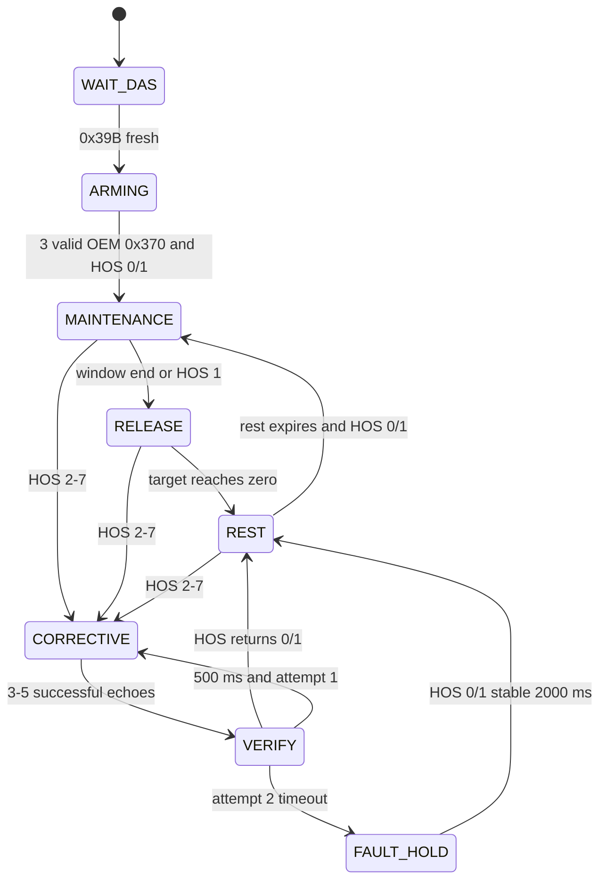

# WiFi-NAG 自适应人力闭环实施计划

> **For agentic workers:** REQUIRED SUB-SKILL: Use superpowers:subagent-driven-development (recommended) or superpowers:executing-plans to implement this plan task-by-task. Steps use checkbox (`- [ ]`) syntax for tracking.

**Goal:** 在不改动持续注入模式、BLE、Wi-Fi、OTA 和其他 CAN 功能的前提下，把 `MODE_ADAPTIVE` 改造成由 DAS `0x39B` 反馈闭环控制的“低强度预防扫动 + 高强度纠正脉冲 + 无发送休息”状态机，并重新设计 NAG 自定义策略 UI 与闭环诊断 UI，明确区分本地发送成功与 DAS 实际响应。

**Architecture:** `NagDasFeedbackTracker` 只负责解析和判定 `0x39B` 新鲜度；`NagAdaptiveController` 是不直接访问 CAN 驱动的纯状态机；`NagHandler` 只负责验证真实 `0x370`、过滤自身回显、生成 counter+1 回显、执行发送并记录时序证据。Web 后端和页面只读状态快照并修改受限配置，不参与实时决策。

**Tech Stack:** C++17、ESP-IDF/Arduino compatibility、ESP32-S3 TWAI、PlatformIO Native + Unity、Python 3 `unittest`、静态 HTML/CSS/JavaScript、NVS Preferences。

**Spec:** `docs/superpowers/plans/2026-08-21-nag-adaptive-closed-loop.md#设计基线`（本文件自包含设计基线；实施时将本文件加入该仓库路径）。

## Global Constraints

- 基线必须是 `V4.2-V13` 分支的 `86d450a`；实施前新建独立 worktree 和 `feat/nag-adaptive-closed-loop` 分支，本计划阶段不改当前仓库。
- 当前仓库中的未跟踪目录 `.venv-tools/` 属于现有本地内容，任何 `git add` 都必须使用显式文件列表，禁止把它加入提交。
- 只改变 `NagHandler::MODE_ADAPTIVE == 5`；`MODE_A == 0` 的固定 `+1.80 Nm` 行为与兼容值 `MODE_A_V2 == 4` 的回退行为保持不变。
- 目标硬件固定为 Waveshare ESP32-S3 WiFi-NAG，TWAI 500 kbit/s，Party CAN pins 2/3；目标车辆基线为 Model Y HW4、车机软件 `2026.2.11`。
- `0x39B` 永远只读；禁止复制、修改或发送 `0x39B`。
- 只有通过校验且不是本机回显的 OEM `0x370` 才能更新真实扭矩、方向和 counter 时序。
- 所有写入 `0x370` 的目标扭矩必须经过 `[-180, +180] cNm` 最终限幅；任何配置、随机数或插值都不能绕过该限幅。
- 自适应模式看不到新鲜、合法的 `0x39B` 时必须停止发送；不得用“本地 `driver.send()` 成功”代替 DAS 接受确认。
- HOS `8`、`15` 或未知值 `9–14` 立即进入 fail-closed；HOS `2–7` 才允许纠正脉冲。
- 休息期的“0”定义为 `shouldSend == false`，即不额外发送 `0x370`，而不是持续发送伪造的 0 Nm 回显。
- 首版继续使用即时 counter+1 echo；Late Echo 不在本计划中实现。只有实测 counter 碰撞证据达到本文件的独立决策门槛后，才另开设计和实施计划。
- 不新增运行时依赖；不改变分区表、Wi-Fi 凭据、BLE 协议、OTA 路由或障碍物换挡逻辑。
- UI 只编辑 `include/web/mcp2515_dashboard_ui.src.h`，随后由 `scripts/minify_dashboard.py` 生成 `include/web/mcp2515_dashboard_ui.base.h`；禁止手工修改生成文件。
- UI 改造限定为 NAG 自定义策略和 NAG 闭环诊断；现有 BLE、网络、系统、固件更新页面的数据合同和功能不得改变。
- 发送验证只能从 listen-only、离线回放、台架开始；道路验证不属于自动化验收。确需实车行为验证时，只能在封闭场地、具备立即接管条件下进行。
- 不承诺“跨车型、跨车机版本 100% 抑制”。首版验收目标是：在已验证的 `0x39B` 映射和新鲜反馈上下文中，测试样本内 HOS 不升到 `2+`；如升到 `2–7`，能记录并验证返回 `0/1` 的闭环延迟。
- 所有提交只保留在本地分支；推送、发布固件或刷写设备需要用户另行明确授权。

---

## 设计基线

### 1. 已确认状态语义

`0x39B` 的 HOS 字段按 `byte[5]` 的 bits `[5:2]` 读取：

```cpp
static uint8_t readDasHandsOnRaw(const CanFrame &frame)
{
    return static_cast<uint8_t>((frame.data[5] >> 2) & 0x0F);
}
```

| HOS | 名称 | 自适应动作 |
|---:|---|---|
| 0 | NOT_REQD | 允许低强度预防窗口；窗口结束后释放并休息 |
| 1 | REQD_DETECTED | 视为 DAS 已检测到输入；当前输出平滑释放到 0，然后进入休息；休息结束后仍可重新进入预防窗口 |
| 2 | REQD_NOT_DETECTED | 立即打断休息/预防，进入纠正脉冲 |
| 3 | VISUAL | 立即纠正脉冲 |
| 4 | CHIME_1 | 立即纠正脉冲 |
| 5 | CHIME_2 | 立即纠正脉冲 |
| 6 | SLOWING | 立即纠正脉冲，但最多两次；失败后停止发送 |
| 7 | STRUCK_OUT | 立即纠正脉冲，但最多两次；失败后停止发送 |
| 8 | SUSPENDED | 立即停止发送并锁定 fail-closed |
| 9–14 | 未定义 | 立即停止发送并锁定 fail-closed |
| 15 | SNA | 立即停止发送并锁定 fail-closed |

### 2. 首版固定默认参数

| 参数 | 默认值 | 可配置边界 | 说明 |
|---|---:|---:|---|
| 预防负向幅值 | `0.15–0.18 Nm` | `0.10–0.50 Nm` | HOS 0/1，注入方向与 OEM 实测扭矩相反 |
| 预防正向幅值 | `0.15–0.18 Nm` | `0.10–0.50 Nm` | 与负向独立配置 |
| 纠正负向幅值 | `1.50–1.80 Nm` | `0.50–1.80 Nm` | HOS 2–7，强脉冲 |
| 纠正正向幅值 | `1.50–1.80 Nm` | `0.50–1.80 Nm` | 与负向独立配置 |
| 方向死区 | `0.05 Nm` | `0–0.50 Nm` | 死区内保持最近可信方向 |
| 方向翻转确认 | `100 ms` | 固定 | 反向实测扭矩连续稳定后才翻转 |
| 角度兜底阈值 | `1.0°` | 固定 | 尚无可信扭矩方向时使用；角度也在阈值内则不发送 |
| 预防活动窗口 | `0.8–1.4 s` | `0.4–3.0 s` | 每个窗口使用三角分布采样时长 |
| 平滑释放 | `0.2–0.4 s` | `0.1–1.0 s` | 使用 smoothstep 从当前幅值衰减到 0 |
| 无发送休息 | `1.5–2.5 s` | `0.5–5.0 s` | 两次均匀随机数取平均形成以 2.0 s 为中心的三角分布 |
| DAS 新鲜度 | `500 ms` | `100–2000 ms` | 超时立即停止发送并进入 WAIT_DAS |
| EPAS 间隔复位 | `200 ms` | 固定 | `0x370` 间隔过长后重新执行 3 帧确认 |
| 纠正脉冲长度 | `3–5` 个成功回显 | 固定 | 每次从 3、4、5 中均匀选择 |
| 纠正重试 | 最多 `2` 次 | 固定 | 两次之间验证 `500 ms` |
| 最终确认超时 | `1000 ms` | 固定 | 第二次脉冲后仍未回到 HOS 0/1 则 fail-closed |
| fail-closed 恢复 | HOS 0/1 连续 `2000 ms` | 固定 | 或关闭再打开 NAG 触发控制器复位 |
| 最终扭矩限幅 | `±1.80 Nm` | 不可提高 | 在编码前最后执行一次 |

随机扫动必须是相关随机过程，而不是逐帧白噪声：预防阶段每个新 OEM `0x370` 只允许幅值变化 `-1/0/+1 cNm`；纠正阶段每帧最多变化 `±5 cNm`。所有随机值由控制器内部 xorshift32 产生，测试通过固定 entropy 获得可重复结果。

### 3. 状态机



所有可发送状态都受以下共同门控：`MODE_ADAPTIVE`、NAG 开关打开、TWAI write enabled、DAS 新鲜、HOS 不是禁止状态、OEM `0x370` 校验通过、不是自身回显、扭矩 raw 不是保留值。

### 4. 开源项目结论如何落地

| 来源 | 采用内容 | 明确不照搬的内容 |
|---|---|---|
| [当前 WiFi-NAG](https://github.com/204442021/WiFi-NAG) | `0x370` checksum、counter+1、own-echo fingerprint、`±1.8 Nm` 编码边界 | “每个真实帧持续发送”不再用于自适应模式 |
| [ev-open-can-tools](https://github.com/ev-open-can-tools/ev-open-can-tools) | burst/pause 思路、listen-only 优先、运行时门控 | 不引入插件系统，不扩大硬件抽象 |
| [flipper-tesla-fsd](https://github.com/hypery11/flipper-tesla-fsd) 与 [issue #122](https://github.com/hypery11/flipper-tesla-fsd/issues/122) | DAS-aware gating、HOS 上升时按需脉冲、`±1.8 Nm` 上限、必须同时看到 `0x370` 与 DAS 状态 | 不采用其超过 `±1.8 Nm` 的旧 organic/grip 参数；不假定单 CAN 一定看得到 `0x39B` |
| [commaai/opendbc](https://github.com/commaai/opendbc) | HOS 枚举和信号语义的交叉校验 | 不引入 opendbc 运行时依赖 |
| [waveshare-single-can-firmware](https://github.com/JordanzhaoD/waveshare-single-can-firmware) | counter 碰撞与 RX→TX→下一 RX 时序诊断 | 首版不启用 Late Echo 调度器 |

本仓库和主要参考项目均为开源项目；实施者只移植行为概念和自行编写代码。若逐行复用外部实现，必须先检查相应文件许可并保留其要求的归属信息。

## 文件职责图

| 路径 | 动作 | 单一职责 |
|---|---|---|
| `include/nag_das_feedback.h` | Create | `0x39B` HOS 解码、合法值分类、新鲜度追踪 |
| `include/nag_adaptive_controller.h` | Modify | 纯状态机、时长采样、相关随机扫动、方向锁存、闭环确认 |
| `include/handlers_base.h` | Modify | CAN 路由、真实帧校验、echo 构造/发送、local-vs-DAS 诊断、时序证据 |
| `include/web/mcp2515_dashboard.h` | Modify | NVS、配置校验、`/api/nag-adaptive` 和状态 JSON |
| `include/web/mcp2515_dashboard_ui.src.h` | Modify | 重做 NAG 自定义策略页与闭环诊断页；保留其他页面功能 |
| `include/web/mcp2515_dashboard_ui.base.h` | Regenerate | 由 `scripts/minify_dashboard.py` 确定性生成 |
| `test/test_native_nag_adaptive/test_nag_adaptive.cpp` | Rewrite | HOS 解析和完整闭环状态机/handler 行为 |
| `test/test_native_nag/test_nag_handler.cpp` | Modify | 持续模式不回归、两 ID 过滤合同、`0x39B` 永不发送 |
| `test/test_native_twai/test_twai_filter.cpp` | Modify | 过滤器硬件宽掩码 + 软件 exact-list 合同 |
| `test/test_v40_adaptive_nag_regression.py` | Delete | 移除“自适应永远持续发送”的旧合同 |
| `test/test_v50_nag_closed_loop_regression.py` | Create | 新字段、NVS 键、UI 元素和禁止行为的静态合同 |
| `test/test_dashboard_main_chain_regression.py` | Modify | 源 UI 与 gzip 生成链保持同步 |
| `README.md` | Modify | 更新自适应说明与测试命令 |
| `docs/nag-adaptive-closed-loop.md` | Create | 状态语义、诊断解释、验证与回滚说明 |

## 实施前检查

- [x] 在现有仓库运行 `git status --short --branch`，确认基线为 `86d450a` 且只存在既有 `.venv-tools/` 未跟踪内容。
- [x] 使用 `superpowers:using-git-worktrees` 在仓库外创建 worktree，并从 `V4.2-V13` 建立 `feat/nag-adaptive-closed-loop`。
- [x] 在新 worktree 运行现有基线：`pio test -e native_nag_adaptive`、`pio test -e native_nag`、`pio test -e native_twai`、`python3 -m unittest test/test_v40_adaptive_nag_regression.py -v`。
- [x] 把本文件复制到新 worktree 的 `docs/superpowers/plans/2026-08-21-nag-adaptive-closed-loop.md`；后续每个 `git add` 均使用显式路径。

---

### Task 1: 建立 DAS HOS 协议边界与双 ID 过滤合同

**Files:**

- Create: `include/nag_das_feedback.h`
- Modify: `include/handlers_base.h:118-124`
- Modify: `test/test_native_nag_adaptive/test_nag_adaptive.cpp`
- Modify: `test/test_native_nag/test_nag_handler.cpp`
- Modify: `test/test_native_twai/test_twai_filter.cpp`

**Interfaces:**

- Consumes: `CanFrame`、`uint32_t nowMs`、CAN IDs `0x370` 与 `0x39B`。
- Produces: `enum class NagDasHandsOnState : uint8_t`、`enum class NagDasClass : uint8_t`、`NagDasFeedbackTracker::observe(const CanFrame &, uint32_t)`、`fresh(uint32_t, uint32_t) const`、`raw() const`、`classification() const`。

- [x] **Step 1: 先写失败测试，锁定 bit extraction、合法值、新鲜度和只读行为**

在 native adaptive 测试中加入这些确切断言：

```cpp
static CanFrame makeDasFrame(uint32_t id, uint8_t hos)
{
    CanFrame frame = {.id = id, .dlc = 8};
    frame.data[5] = static_cast<uint8_t>((hos & 0x0F) << 2);
    return frame;
}

void test_das_hos_uses_byte5_bits_5_through_2()
{
    NagDasFeedbackTracker tracker;
    CanFrame frame = makeDasFrame(0x39B, 3);
    TEST_ASSERT_TRUE(tracker.observe(frame, 100));
    TEST_ASSERT_EQUAL_UINT8(3, tracker.raw());
    TEST_ASSERT_EQUAL_UINT8(static_cast<uint8_t>(NagDasClass::CORRECTIVE),
                            static_cast<uint8_t>(tracker.classification()));
}

void test_das_feedback_expires_at_501ms()
{
    NagDasFeedbackTracker tracker;
    TEST_ASSERT_TRUE(tracker.observe(makeDasFrame(0x39B, 0), 100));
    TEST_ASSERT_TRUE(tracker.fresh(600, 500));
    TEST_ASSERT_FALSE(tracker.fresh(601, 500));
}

void test_unknown_and_sna_hos_fail_closed()
{
    NagDasFeedbackTracker tracker;
    TEST_ASSERT_FALSE(tracker.observe(makeDasFrame(0x39B, 9), 100));
    TEST_ASSERT_EQUAL_UINT8(static_cast<uint8_t>(NagDasClass::BLOCKED),
                            static_cast<uint8_t>(tracker.classification()));
    TEST_ASSERT_FALSE(tracker.observe(makeDasFrame(0x39B, 15), 110));
}
```

在 `test_nag_handler.cpp` 把过滤合同改成两个 exact IDs，并断言收到 `0x39B` 时 `mock.sent.size() == 0`。在 `test_twai_filter.cpp` 断言硬件 filter 至少接收 `0x370` 和 `0x39B`，同时 `exactCanIdMatches()` 拒绝 `0x371`、`0x39A`、`0x399` 和 `0x3FD`。

- [x] **Step 2: 运行测试并确认因类型/双 ID 尚不存在而失败**

Run:

```bash
pio test -e native_nag_adaptive
pio test -e native_nag
pio test -e native_twai
```

Expected: adaptive 编译失败，提示 `NagDasFeedbackTracker` 未定义；handler/filter 测试因当前 count 为 1 而失败。

- [x] **Step 3: 添加最小、完整的只读反馈类型**

`include/nag_das_feedback.h` 必须提供以下公开合同；未知 HOS 会保留 raw 值但令 `valid_ == false`，使 `fresh()` 返回 false：

```cpp
#pragma once

#include <cstdint>
#include "can_frame_types.h"

enum class NagDasHandsOnState : uint8_t
{
    NOT_REQUIRED = 0,
    REQUIRED_DETECTED = 1,
    REQUIRED_NOT_DETECTED = 2,
    VISUAL = 3,
    CHIME_1 = 4,
    CHIME_2 = 5,
    SLOWING = 6,
    STRUCK_OUT = 7,
    SUSPENDED = 8,
    SNA = 15,
};

enum class NagDasClass : uint8_t
{
    NORMAL = 0,
    CORRECTIVE = 1,
    BLOCKED = 2,
};

class NagDasFeedbackTracker
{
public:
    static constexpr uint32_t kDasCanId = 0x39B;

    static uint8_t readRaw(const CanFrame &frame)
    {
        return static_cast<uint8_t>((frame.data[5] >> 2) & 0x0F);
    }

    bool observe(const CanFrame &frame, uint32_t nowMs)
    {
        if (frame.id != kDasCanId || frame.dlc < 8)
            return false;
        raw_ = readRaw(frame);
        lastAtMs_ = nowMs;
        seen_ = true;
        valid_ = raw_ <= 8;
        if (raw_ == 15)
            valid_ = false;
        class_ = raw_ <= 1 ? NagDasClass::NORMAL
                           : (raw_ <= 7 ? NagDasClass::CORRECTIVE
                                        : NagDasClass::BLOCKED);
        return valid_;
    }

    bool fresh(uint32_t nowMs, uint32_t timeoutMs) const
    {
        return seen_ && valid_ && static_cast<uint32_t>(nowMs - lastAtMs_) <= timeoutMs;
    }

    bool seen() const { return seen_; }
    bool valid() const { return valid_; }
    uint8_t raw() const { return raw_; }
    uint32_t ageMs(uint32_t nowMs) const
    {
        return seen_ ? static_cast<uint32_t>(nowMs - lastAtMs_) : 0xFFFFFFFFu;
    }
    NagDasClass classification() const { return class_; }

private:
    bool seen_ = false;
    bool valid_ = false;
    uint8_t raw_ = 15;
    uint32_t lastAtMs_ = 0;
    NagDasClass class_ = NagDasClass::BLOCKED;
};
```

把 `NagHandler::filterIds()` 改为 `{0x370, 0x39B}`，`filterIdCount()` 改为 `2`。此任务只完成过滤和解析，不发送或触发状态机。

- [x] **Step 4: 运行三组测试并确认通过**

Run: 同 Step 2。

Expected: 三个 PlatformIO 环境均为 PASS；`0x39B` 路径零发送。

- [x] **Step 5: 提交协议边界**

```bash
git add -- include/nag_das_feedback.h include/handlers_base.h test/test_native_nag_adaptive/test_nag_adaptive.cpp test/test_native_nag/test_nag_handler.cpp test/test_native_twai/test_twai_filter.cpp
git commit -m "feat: add DAS hands-on feedback contract"
```

---

### Task 2: 将自适应控制器重写为可重复测试的闭环状态机

**Files:**

- Modify: `include/nag_adaptive_controller.h`
- Rewrite: `test/test_native_nag_adaptive/test_nag_adaptive.cpp`

**Interfaces:**

- Consumes: `NagDasFeedbackTracker`、合法 OEM `0x370` 的 `nowMs/angle/torque/entropy`、发送结果。
- Produces: `NagAdaptiveConfig`、`NagAdaptiveDecision`、`NagAdaptiveSnapshot`、`NagAdaptiveController::observeDas()`、`observeEpas()`、`onTransmitResult()`、`snapshot()`。

- [x] **Step 1: 用失败测试锁定完整状态转换和随机边界**

测试文件必须包含并运行以下具名用例：

```cpp
RUN_TEST(test_adaptive_never_sends_without_fresh_das);
RUN_TEST(test_adaptive_requires_three_valid_oem_epas_frames);
RUN_TEST(test_hos_0_runs_preventive_window_release_and_no_tx_rest);
RUN_TEST(test_hos_1_interrupts_preventive_window_into_release);
RUN_TEST(test_rest_duration_uses_1500_to_2500ms_triangular_bounds);
RUN_TEST(test_preventive_walk_stays_between_15_and_18_centi_nm);
RUN_TEST(test_preventive_walk_changes_by_at_most_one_centi_nm_per_frame);
RUN_TEST(test_measured_torque_selects_opposite_injection_direction);
RUN_TEST(test_direction_flip_requires_100ms_stability);
RUN_TEST(test_deadband_holds_last_trusted_direction);
RUN_TEST(test_no_torque_and_no_angle_direction_blocks_send);
RUN_TEST(test_hos_2_through_7_interrupt_every_nonfault_phase);
RUN_TEST(test_corrective_burst_has_three_to_five_successful_echoes);
RUN_TEST(test_corrective_walk_stays_between_150_and_180_centi_nm);
RUN_TEST(test_hos_return_to_0_or_1_records_ack_latency);
RUN_TEST(test_second_failed_corrective_attempt_enters_fault_hold);
RUN_TEST(test_hos_8_9_and_15_enter_fault_hold_without_send);
RUN_TEST(test_das_stale_during_send_returns_wait_das);
RUN_TEST(test_epas_gap_over_200ms_rearms_three_frame_guard);
RUN_TEST(test_every_decision_is_clamped_to_plus_minus_180_centi_nm);
```

关键测试应使用固定 entropy，并检查整个序列，而不是只看最后一帧。例如预防窗口测试必须覆盖 `MAINTENANCE → RELEASE → REST → MAINTENANCE`，且 REST 中每一帧都断言 `shouldSend == false`。

- [x] **Step 2: 运行测试并确认旧控制器无法满足新合同**

Run: `pio test -e native_nag_adaptive`

Expected: FAIL；旧实现只有 `ARMING/SEND` 且没有 DAS、REST、CORRECTIVE、VERIFY、FAULT_HOLD。

- [x] **Step 3: 替换配置、决策和快照类型**

使用以下确切字段和默认值，删除旧的 `angleLimitDeciDeg/sendWindowMs/pauseMinMs/pauseMaxMs` 兼容配置：

```cpp
struct NagAdaptiveConfig
{
    int16_t preventiveNegativeMinCentiNm = 15;
    int16_t preventiveNegativeMaxCentiNm = 18;
    int16_t preventivePositiveMinCentiNm = 15;
    int16_t preventivePositiveMaxCentiNm = 18;
    int16_t correctiveNegativeMinCentiNm = 150;
    int16_t correctiveNegativeMaxCentiNm = 180;
    int16_t correctivePositiveMinCentiNm = 150;
    int16_t correctivePositiveMaxCentiNm = 180;
    int16_t torqueDeadbandCentiNm = 5;
    uint32_t activityMinMs = 800;
    uint32_t activityMaxMs = 1400;
    uint32_t releaseMinMs = 200;
    uint32_t releaseMaxMs = 400;
    uint32_t restMinMs = 1500;
    uint32_t restMaxMs = 2500;
    uint32_t dasFreshTimeoutMs = 500;
};

struct NagAdaptiveDecision
{
    bool shouldSend = false;
    int16_t targetTorqueCentiNm = 0;
    int8_t injectionSign = 0;
    bool corrective = false;
    uint8_t attempt = 0;
    uint8_t burstFrame = 0;
};

struct NagAdaptiveSnapshot
{
    uint8_t phase = 0;
    uint8_t blockReason = 0;
    uint8_t directionSource = 0;
    bool dasSeen = false;
    bool dasFresh = false;
    uint8_t dasHos = 15;
    uint32_t dasAgeMs = 0xFFFFFFFFu;
    int16_t observedTorqueCentiNm = 0;
    int16_t targetTorqueCentiNm = 0;
    int8_t injectionSign = 0;
    uint8_t correctiveAttempt = 0;
    uint8_t correctiveBurstFrame = 0;
    uint8_t correctiveBurstFrameTarget = 0;
    uint32_t phaseRemainingMs = 0;
    uint32_t hosEscalationCount = 0;
    uint32_t acknowledgementCount = 0;
    uint32_t acknowledgementTimeoutCount = 0;
    uint32_t lastAcknowledgementLatencyMs = 0;
    uint32_t maxAcknowledgementLatencyMs = 0;
};
```

`normalizeConfig()` 必须交换反向 min/max，并强制：预防范围 `10–50 cNm`、纠正范围 `50–180 cNm`、死区 `0–50 cNm`、活动 `400–3000 ms`、释放 `100–1000 ms`、休息 `500–5000 ms`、DAS 新鲜度 `100–2000 ms`。

- [x] **Step 4: 实现纯状态机公开合同**

公开接口必须固定为：

```cpp
class NagAdaptiveController
{
public:
    enum Phase : uint8_t
    {
        PHASE_DISABLED = 0,
        PHASE_WAIT_DAS = 1,
        PHASE_ARMING = 2,
        PHASE_MAINTENANCE = 3,
        PHASE_RELEASE = 4,
        PHASE_REST = 5,
        PHASE_CORRECTIVE = 6,
        PHASE_VERIFY = 7,
        PHASE_FAULT_HOLD = 8,
    };

    enum BlockReason : uint8_t
    {
        BLOCK_NONE = 0,
        BLOCK_DISABLED = 1,
        BLOCK_DAS_MISSING = 2,
        BLOCK_DAS_STALE = 3,
        BLOCK_ARMING = 4,
        BLOCK_REST = 5,
        BLOCK_NO_DIRECTION = 6,
        BLOCK_VERIFY = 7,
        BLOCK_DAS_STATE = 8,
        BLOCK_ACK_TIMEOUT = 9,
    };

    enum DirectionSource : uint8_t
    {
        DIRECTION_NONE = 0,
        DIRECTION_TORQUE = 1,
        DIRECTION_ANGLE = 2,
        DIRECTION_HOLD = 3,
    };

    static NagAdaptiveConfig normalizeConfig(NagAdaptiveConfig value);
    void setConfig(const NagAdaptiveConfig &requested);
    NagAdaptiveConfig config() const;
    void requestReset();
    void disable(uint32_t nowMs);
    bool observeDas(const CanFrame &frame, uint32_t nowMs);
    NagAdaptiveDecision observeEpas(uint32_t nowMs,
                                    int16_t steeringAngleDeciDeg,
                                    int16_t observedTorqueCentiNm,
                                    uint32_t entropy);
    void onTransmitResult(uint32_t nowMs,
                          const NagAdaptiveDecision &decision,
                          bool success);
    NagAdaptiveSnapshot snapshot(uint32_t nowMs) const;
};
```

内部实现遵守这些精确规则：

1. xorshift32 状态为 0 时先与 `entropy ^ 0x9E3779B9u` 混合；仍为 0 则使用 `0xA341316Cu`。
2. 三角时长采样使用两个 `uint16_t` 随机数之和除以 2，再线性映射到 `[min,max]`。
3. `desiredSign` 首选 `observedTorque > deadband ? -1 : observedTorque < -deadband ? +1 : 0`；死区内保持旧方向；无旧方向时，角度 `> +10 deci°` 取 `-1`、`< -10 deci°` 取 `+1`；两者都无方向时阻止发送。
4. 与当前方向相反的候选方向连续保持 100 ms 后才切换；任何死区帧取消候选但不清除旧方向。
5. 预防阶段幅值步长只取 `-1/0/+1 cNm`，纠正阶段步长限制在 `-5..+5 cNm`，每次都 clamp 到当前方向的相应范围。
6. RELEASE 保存开始扭矩与随机 `200–400 ms` 时长，使用 `1 - (3x² - 2x³)` 的 smoothstep 权重；结果四舍五入为 0 时进入 REST 且不发送该帧。
7. 纠正 burst 的 frame 计数只在 `onTransmitResult(nowMs, decision, true)` 中递增；发送失败不消耗 burst 帧数。
8. 第一次纠正 burst 完成后 VERIFY 500 ms；HOS 仍为 2–7 时开始第二次；第二次后 1000 ms 未回到 0/1 则进入 FAULT_HOLD。
9. 从 HOS 2–7 回到 0/1 时，以第一次纠正成功 TX 的时间计算 acknowledgement latency；只在 DAS 反馈转移时增加确认计数。
10. HOS 8/15/未知、DAS 过期、控制器 disabled 均返回 `shouldSend=false`。`observeDas()` 即使收到 tracker 判为 invalid 的 9–15，也必须读取保留的 raw/class 并把 9–15 锁入 FAULT_HOLD；只有单纯超时才进入 WAIT_DAS。

- [x] **Step 5: 运行自适应测试并确认全通过**

Run: `pio test -e native_nag_adaptive`

Expected: 20 个新状态机用例全部 PASS；输出从不超过 `±180 cNm`。

- [x] **Step 6: 提交纯控制器**

```bash
git add -- include/nag_adaptive_controller.h test/test_native_nag_adaptive/test_nag_adaptive.cpp
git commit -m "feat: add HOS-aware adaptive torque state machine"
```

---

### Task 3: 集成 handler、发送结果反馈与 counter 时序证据

**Files:**

- Modify: `include/handlers_base.h:60-567`
- Modify: `test/test_native_nag/test_nag_handler.cpp`
- Modify: `test/test_native_nag_adaptive/test_nag_adaptive.cpp`
- Modify: `test/test_native_nag_sweep/test_nag_sweep_timing.cpp`

**Interfaces:**

- Consumes: Task 2 的 `observeDas/observeEpas/onTransmitResult/snapshot`。
- Produces: 自适应模式的真实 CAN 集成；`nagCounterCollisionCount`、`nagLastCounterCollisionGapUs`、`nagDasFrameCount`、本地 TX 计数与 DAS 确认快照。

- [x] **Step 1: 先写 handler 集成失败测试**

新增以下确切行为测试：

```cpp
RUN_TEST(test_39b_is_observed_but_never_echoed);
RUN_TEST(test_adaptive_370_does_not_send_before_fresh_39b);
RUN_TEST(test_adaptive_uses_only_non_own_370_for_direction);
RUN_TEST(test_adaptive_uses_decision_target_without_legacy_h1_h2_ranges);
RUN_TEST(test_local_send_success_does_not_increment_das_ack_count);
RUN_TEST(test_das_transition_from_3_to_1_records_ack_after_tx);
RUN_TEST(test_failed_send_does_not_advance_corrective_burst);
RUN_TEST(test_counter_collision_is_recorded_on_next_oem_counter_match);
RUN_TEST(test_counter_wrap_15_to_0_is_recorded_correctly);
RUN_TEST(test_continuous_mode_remains_independent_of_39b);
RUN_TEST(test_echo_hands_on_bits_remain_forced_to_one);
RUN_TEST(test_echo_checksum_and_plus_one_counter_remain_valid);
```

counter 测试时序固定为：OEM `C` 在 `100000 us` 到达，成功发送 echo `C+1`，下一 OEM `C+1` 在 `120000 us` 到达；期望 collision count 增加 1，gap 为 `20000 us`。超过 `100000 us` 的同 counter 不计入碰撞。

- [x] **Step 2: 运行三个 native 环境并确认集成测试失败**

Run:

```bash
pio test -e native_nag_adaptive
pio test -e native_nag
pio test -e native_nag_sweep
```

Expected: FAIL；旧 handler 不路由 `0x39B`，且仍由 `adaptiveMagnitudeCentiNm()` 生成持续幅值。

- [x] **Step 3: 把 `handleMessage()` 拆成明确的只读 DAS 分支和 OEM EPAS 分支**

核心路由顺序固定为：

```cpp
void handleMessage(CanFrame &frame, CanDriver &driver) override
{
    if (onFrame)
        onFrame(frame);

    const uint32_t now = nowMs();
    if (frame.id == NagDasFeedbackTracker::kDasCanId)
    {
        if (frame.dlc >= 8)
        {
            nagDasFrameCount++;
            adaptiveController.observeDas(frame, now);
        }
        return;
    }

    if (frame.id != 0x370 || frame.dlc < 8)
        return;

    if (isOwnEcho(frame))
    {
        nagOwnEchoSkipCount++;
        return;
    }

    if (static_cast<uint8_t>(nagMode) == MODE_ADAPTIVE && !verifyChecksum(frame))
    {
        nagChecksumRejectCount++;
        return;
    }

    // 后续只用这个已确认非自身回显的 OEM frame 更新观察值和决策。
}
```

自适应分支直接使用 `decision.targetTorqueCentiNm`；删除 handler 中旧的 `handsOn1/2*` Shared 字段、`lastHandsOnTier`、`smoothRangeMagnitudeCentiNm()`、`adaptiveMagnitudeCentiNm()` 和相关 transition 状态。持续模式仍调用 `targetTorqueCentiNm()` 返回 `+180 cNm`。

- [x] **Step 4: 将发送结果回传控制器并保持现有 echo 合同**

在最终编码前再次执行 `clampTorqueCentiNm(decision.targetTorqueCentiNm)`。继续复制 OEM frame、强制 EPAS Hands-On bits 为 1、counter low nibble 加 1、按当前 `+0x73` 算法重算 checksum。无论发送成功或失败都调用：

```cpp
const bool sent = driver.send(echo);
adaptiveController.onTransmitResult(now, decision, sent);
if (sent)
{
    framesSent++;
    nagEchoCount++;
    lastInjectedCentiNm = torqueCentiNm;
    lastInjectedAtMs = now;
    lastInjectedValid = true;
    rememberSuccessfulEcho(echo);
}
else
{
    nagSendFailureCount++;
}
```

不得在 `driver.send()` 之前更新“实际注入”快照，不得因本地成功直接修改 acknowledgement count。

- [x] **Step 5: 添加微秒级 counter 碰撞证据**

ESP 构建使用 `esp_timer_get_time()`，native 测试增加 `setTestNowUs(uint64_t)`。每次成功 echo 保存 `counter/txUs`；下一个非 own-echo OEM `0x370` 若 counter 与保存值相同且 gap 在 `1..100000 us`，更新：

```cpp
Shared<uint32_t> nagCounterCollisionCount{0};
Shared<uint32_t> nagLastCounterCollisionGapUs{0};
Shared<uint32_t> nagDasFrameCount{0};
Shared<uint32_t> nagOemEpasFrameCount{0};
Shared<uint32_t> nagLastOemEpasAtMs{0};
Shared<uint8_t> nagLastOemEpasCounter{0};
```

`nagOemEpasFrameCount` 只统计已排除 own echo 且通过自适应校验的 OEM `0x370`；`nagLastOemEpasAtMs/counter` 同样只由该路径更新。这些字段与 counter collision 都只是诊断，不改变发送调度，也不使用 `delay()`。

- [x] **Step 6: 运行 handler、adaptive 和 sweep 回归**

Run: 同 Step 2。

Expected: 全部 PASS；持续模式每个 OEM frame 仍发固定 `+1.80 Nm`，自适应模式按状态机间歇发送。

- [x] **Step 7: 提交 CAN 集成**

```bash
git add -- include/handlers_base.h test/test_native_nag/test_nag_handler.cpp test/test_native_nag_adaptive/test_nag_adaptive.cpp test/test_native_nag_sweep/test_nag_sweep_timing.cpp
git commit -m "feat: integrate adaptive HOS feedback and CAN diagnostics"
```

---

### Task 4: 更新 NVS、配置 API 和状态遥测合同

**Files:**

- Modify: `include/web/mcp2515_dashboard.h:352-567,594-625,731-791,962-1075,1116-1208,1285-1296`
- Delete: `test/test_v40_adaptive_nag_regression.py`
- Create: `test/test_v50_nag_closed_loop_regression.py`

**Interfaces:**

- Consumes: `NagAdaptiveConfig` 与 `NagAdaptiveSnapshot`。
- Produces: `/api/nag-adaptive` GET/POST 配置和状态 JSON；新的 NVS key 集合；旧 key 保留但不再读取。

- [x] **Step 1: 建立失败的 Python 静态合同测试**

新测试必须断言：

```python
EXPECTED_NVS_KEYS = (
    "nag_pv_n_min", "nag_pv_n_max", "nag_pv_p_min", "nag_pv_p_max",
    "nag_cr_n_min", "nag_cr_n_max", "nag_cr_p_min", "nag_cr_p_max",
    "nag_act_min", "nag_act_max", "nag_rel_min", "nag_rel_max",
    "nag_rst_min", "nag_rst_max", "nag_dir_db", "nag_das_ms",
)

EXPECTED_STATUS_FIELDS = (
    "nagDasSeen", "nagDasFresh", "nagDasAgeMs", "nagDasHos",
    "nagDasFrames", "nagOemEpasFrames", "nagLastOemEpasAgeMs",
    "nagLastOemEpasCounter", "nagObservedTorqueNm",
    "nagAdaptivePhase", "nagAdaptiveBlockReason",
    "nagAdaptiveTargetTorqueNm", "nagAdaptivePhaseRemainingMs",
    "nagCorrectiveAttempt", "nagCorrectiveBurstFrame",
    "nagCorrectiveBurstFrameTarget", "nagHosEscalations",
    "nagAcknowledgementCount", "nagAcknowledgementTimeouts",
    "nagLastAcknowledgementLatencyMs", "nagMaxAcknowledgementLatencyMs",
    "nagSendAttempts", "nagSendFailures", "nagEcho",
    "nagCounterCollisions", "nagLastCounterCollisionGapUs",
)
```

同时断言 dashboard 后端不出现 `prefs.getString("nag_h1_`、`prefs.getString("nag_h2_`、`adaptiveSendWindowSec`、`adaptivePauseMinSec` 或 `adaptivePauseMaxSec`；`0x39B` 只出现在观察路径，不能出现在 `driver.send` 的 frame ID 赋值中。

- [x] **Step 2: 运行 Python 测试并确认失败**

Run: `python3 -m unittest test/test_v50_nag_closed_loop_regression.py -v`

Expected: FAIL；新 NVS keys 和状态字段尚不存在。

- [x] **Step 3: 用新 keys 保存配置，禁止把旧 1.50–1.80 默认值误当成预防幅值**

使用下列 key/default 配对：

```text
nag_pv_n_min=0.15  nag_pv_n_max=0.18  nag_pv_p_min=0.15  nag_pv_p_max=0.18
nag_cr_n_min=1.50  nag_cr_n_max=1.80  nag_cr_p_min=1.50  nag_cr_p_max=1.80
nag_act_min=0.8    nag_act_max=1.4    nag_rel_min=0.2   nag_rel_max=0.4
nag_rst_min=1.5    nag_rst_max=2.5    nag_dir_db=0.05   nag_das_ms=500
```

旧 `nag_h1_*`、`nag_h2_*` 和 `nag_ad_*` keys 不删除，便于回滚旧固件，但新控制器不读取它们。所有 POST 值先解析，再经 `NagAdaptiveController::normalizeConfig()`，仅当归一化后的结构不同才 `setConfig()` 并重置状态机。

- [x] **Step 4: 固定 API 字段名并返回 local-vs-DAS 两类结果**

配置字段使用：

```text
preventiveNegativeMinNm preventiveNegativeMaxNm preventivePositiveMinNm preventivePositiveMaxNm
correctiveNegativeMinNm correctiveNegativeMaxNm correctivePositiveMinNm correctivePositiveMaxNm
activityMinSec activityMaxSec releaseMinSec releaseMaxSec restMinSec restMaxSec
directionDeadbandNm dasFreshTimeoutMs
```

状态必须同时返回：OEM `0x370` 帧数/age/counter/扭矩，DAS `0x39B` 帧数/age/HOS，本地 `nagSendAttempts/nagSendFailures/nagEcho`，控制器 attempt/burst progress/escalation，以及 DAS `nagAcknowledgementCount/nagAcknowledgementTimeouts/latency`。UI 或 API 文案不得把 `nagEcho` 命名为“DAS 已接受”。

更新 `dashNagAdaptivePhaseName()` 为 `disabled/wait-das/arming/maintenance/release/rest/corrective/verify/fault-hold`；更新 block reason 和 direction source 名称。`dashNagStatusJson()` 与 `/status` 的 prefixed JSON 字段必须一致。

- [x] **Step 5: 运行 API 合同和 native 回归**

Run:

```bash
python3 -m unittest test/test_v50_nag_closed_loop_regression.py -v
pio test -e native_nag_adaptive
pio test -e native_nag
```

Expected: 全部 PASS。

- [x] **Step 6: 提交配置和遥测后端**

```bash
git add -- include/web/mcp2515_dashboard.h test/test_v40_adaptive_nag_regression.py test/test_v50_nag_closed_loop_regression.py
git commit -m "feat: expose closed-loop NAG config and diagnostics"
```

---

### Task 5: 重做 NAG 自定义策略 UI

**Files:**

- Modify: `include/web/mcp2515_dashboard_ui.src.h:207-215,519-566,1049,1350-1371,1702-1785`
- Regenerate: `include/web/mcp2515_dashboard_ui.base.h`
- Modify: `test/test_v50_nag_closed_loop_regression.py`
- Modify: `test/test_dashboard_main_chain_regression.py`

**Interfaces:**

- Consumes: Task 4 的配置字段和 readiness 状态。
- Produces: 独立、移动端自适应的“自定义策略”界面；预防层、纠正层、节奏层和安全边界不再挤在一个 H1/H2 表格里。

- [x] **Step 1: 先用失败测试锁定页面元素和文字语义**

静态合同必须要求以下 element IDs：

```python
EXPECTED_CUSTOM_UI_IDS = (
    "nag-custom-readiness", "nag-custom-readiness-reason",
    "nag-custom-dirty", "nag-custom-defaults", "nag-custom-save",
    "nag-pv-neg-min", "nag-pv-neg-max", "nag-pv-pos-min", "nag-pv-pos-max",
    "nag-cr-neg-min", "nag-cr-neg-max", "nag-cr-pos-min", "nag-cr-pos-max",
    "nag-active-min", "nag-active-max", "nag-release-min", "nag-release-max",
    "nag-rest-min", "nag-rest-max", "nag-direction-deadband",
    "nag-custom-hard-cap", "nag-custom-das-timeout",
)
```

测试还必须断言页面包含“预防层”“纠正层”“节奏与休息”“安全边界”“休息期不额外发送 0x370”“本地发送成功不等于 DAS 接受”，且不再包含“反方向持续注入”“Hands-On 1 扭矩范围”“Hands-On 2 扭矩范围”。

- [x] **Step 2: 运行 UI 合同并确认失败**

Run:

```bash
python3 -m unittest test/test_v50_nag_closed_loop_regression.py -v
python3 -m unittest test/test_dashboard_main_chain_regression.py -v
```

Expected: FAIL；当前页面仍只有 H1/H2 四组范围，没有自定义策略分区、dirty state 或恢复默认值操作。

- [x] **Step 3: 把功能页重做为“总控 + 自定义策略”两层结构**

保留顶部 NAG 开关和 `持续注入/自适应` mode segmented control，但把自适应区域改成四张子卡：

1. `策略就绪状态`：显示 READY、WAIT_DAS、FAIL_CLOSED 或 DISABLED，以及一句具体原因。
2. `预防层`：负/正方向最小和最大幅值；输入边界 `min="0.10" max="0.50" step="0.01"`。
3. `纠正层`：负/正方向最小和最大幅值；输入边界 `min="0.50" max="1.80" step="0.01"`。
4. `节奏与休息`：活动 `0.4–3.0 s`、释放 `0.1–1.0 s`、休息 `0.5–5.0 s`、死区 `0–0.50 Nm`。

底部固定操作条显示“有未保存修改/已与设备同步”，提供“恢复建议值”和“保存自定义策略”。硬限幅 `±1.80 Nm`、DAS timeout `500 ms` 和“休息期不发额外帧”以只读安全约束呈现，不允许 UI 提高硬限幅。

桌面宽度 `>=900 px` 时预防/纠正两列，节奏三列；窄屏时全部单列。现有 bottom navigation 和 BLE/网络/设置页面 DOM 所属关系保持不变。

- [x] **Step 4: 重写自定义配置状态、dirty state 和保存行为**

将页面配置缓存改为一个结构化对象：

```javascript
const nagCustomDefaults={
  preventiveNegative:[0.15,0.18], preventivePositive:[0.15,0.18],
  correctiveNegative:[1.50,1.80], correctivePositive:[1.50,1.80],
  activity:[0.8,1.4], release:[0.2,0.4], rest:[1.5,2.5],
  directionDeadband:0.05, dasFreshTimeoutMs:500
};
```

所有 input 的 `input` 事件只更新本地 draft 和 dirty 标志，不立即 POST。`nag-custom-defaults` 只把 draft 恢复到上述值并标记 dirty；用户点击保存才发请求。

`saveNagAdaptive()` 对每个输入先做与后端一致的 clamp/swap，再通过 `URLSearchParams` POST 到 `/api/nag-adaptive`。成功后必须使用响应 JSON 回填归一化值、清除 dirty；失败时保留 draft，显示错误，不用旧状态覆盖用户输入。切换离开功能页时若 dirty 为 true，不弹阻断对话框，只保留明显的“未保存”标志。

readiness 映射固定为：adaptive 关闭=`DISABLED`；`nagDasFresh == false`=`WAIT_DAS`；phase 为 `fault-hold`=`FAIL_CLOSED`；其余 fresh 自适应状态=`READY`。DAS stale 时显示红色“反馈失效，已停止自适应注入”，但不自动切换到持续模式。

- [x] **Step 5: 生成并校验 gzip 页面**

Run:

```bash
python3 scripts/minify_dashboard.py
python3 scripts/minify_dashboard.py --check
```

Expected: 生成成功；`--check` exit 0 且不提示 `generated payload is stale`。

- [x] **Step 6: 运行 UI 和主链回归**

Run: 同 Step 2。

Expected: 两个 Python 测试文件均 PASS；自定义输入、默认值、dirty state 和保存字段完整。

- [x] **Step 7: 提交页面与生成产物**

```bash
git add -- include/web/mcp2515_dashboard_ui.src.h include/web/mcp2515_dashboard_ui.base.h test/test_v50_nag_closed_loop_regression.py test/test_dashboard_main_chain_regression.py
git commit -m "feat: redesign adaptive NAG custom controls"
```

---

### Task 6: 重做 NAG 闭环诊断 UI

**Files:**

- Modify: `include/web/mcp2515_dashboard_ui.src.h:141-143,214-215,757-797,1189-1207,1356-1371,1680-1738,1855-1883,2016-2049`
- Regenerate: `include/web/mcp2515_dashboard_ui.base.h`
- Modify: `test/test_v50_nag_closed_loop_regression.py`
- Modify: `test/test_dashboard_main_chain_regression.py`

**Interfaces:**

- Consumes: Task 4 的 OEM、DAS、controller、local TX、ack 和 collision 状态字段。
- Produces: 诊断页顶部的 NAG 闭环健康面板、四层数据分组、最近事件时间线和仅在诊断页活动的轻量轮询。

- [x] **Step 1: 先写失败测试锁定诊断信息架构**

静态合同必须要求：

```python
EXPECTED_DIAGNOSTIC_UI_IDS = (
    "nag-diag-health", "nag-diag-reason",
    "nag-diag-epas", "nag-diag-oem-torque", "nag-diag-counter",
    "nag-diag-das", "nag-diag-hos",
    "nag-diag-phase", "nag-diag-target", "nag-diag-direction",
    "nag-diag-timer", "nag-diag-burst",
    "nag-diag-tx", "nag-diag-last-tx", "nag-diag-collision",
    "nag-diag-ack", "nag-diag-latency", "nag-diag-timeout",
    "nag-diag-escalations", "nag-diag-events", "nag-diag-clear-events",
)
```

测试必须断言 NAG 诊断区位于 `advanced-diagnostics` 之前且默认可见；现有 CAN、BLE、网络和系统诊断 IDs 仍存在；页面包含“原车输入”“控制器决策”“本地发送”“DAS 响应”四个标题。

- [x] **Step 2: 运行诊断 UI 合同并确认失败**

Run:

```bash
python3 -m unittest test/test_v50_nag_closed_loop_regression.py -v
python3 -m unittest test/test_dashboard_main_chain_regression.py -v
```

Expected: FAIL；当前高级诊断只有 4 个 NAG 文本值，且折叠后不可见。

- [x] **Step 3: 重建诊断页顶部 NAG 健康面板**

把原有 `NAG 运行数据` 从 `<details id="advanced-diagnostics">` 中移出，放在 monitor toggle 和通用设备状态之后、advanced details 之前。结构固定为：

- 健康条：`ACTIVE / READY / WAIT_DAS / FAIL_CLOSED / DISABLED`，下方显示唯一 block reason。
- 原车输入：OEM `0x370` count/age/counter/torque；DAS `0x39B` count/age/HOS/freshness。
- 控制器决策：phase、target torque、direction source、phase remaining、corrective attempt 和 burst `current/target`。
- 本地发送：attempt/success/failure、last injected torque/age、counter collision count/last gap。
- DAS 响应：HOS escalation count、ack count、timeout count、last/max latency。
- 最近闭环事件：最多 20 条，最新在上；每条包含浏览器时间、event type 和 old→new 值。

颜色语义固定为：绿色只用于 `fresh/READY/ack`；黄色用于 `release/rest/verify/collision`；红色用于 `stale/fault/timeout/send failure`；灰色用于 disabled/未见数据。不得用绿色表示单纯的 local send success。

- [x] **Step 4: 增加纯前端事件时间线**

维护 `nagDiagnosticPrevious` 与 `nagDiagnosticEvents`。仅当以下字段变化时追加事件：`nagDasFresh`、`nagDasHos`、`nagAdaptivePhase`、`nagAcknowledgementCount`、`nagAcknowledgementTimeouts`、`nagCounterCollisions`。相同轮询值不重复追加；数组超过 20 条时删除最旧项。`nag-diag-clear-events` 只清浏览器内存，不调用后端、不清设备计数。

phase 名称固定为：

```javascript
const phaseNames={
  disabled:'关闭', 'wait-das':'等待 DAS', arming:'确认 OEM 帧',
  maintenance:'预防扫动', release:'平滑释放', rest:'无发送休息',
  corrective:'纠正脉冲', verify:'等待 DAS 确认',
  'fault-hold':'故障停发'
};
```

- [x] **Step 5: 添加诊断页专用轻量轮询生命周期**

复用现有 `/api/nag-adaptive`，不新增路由。增加 `nagDiagnosticsTimer`：只有 `data-page="diagnostics"` 当前 active、system monitor 打开、页面可见时才轮询；普通浏览器每 `500 ms`，Car UI 或网络性能模式每 `1000 ms`。离开诊断页、关闭 monitor 或 `document.hidden == true` 时必须 `clearInterval()`。

每次响应只调用 `updateNagDiagnostics(data)`，不得触发 Wi-Fi、BLE、DNS 或 system-status 请求。现有全局 `/status` 轮询保持不变，避免影响其他页面。

- [x] **Step 6: 生成页面并运行 UI 回归**

Run:

```bash
python3 scripts/minify_dashboard.py
python3 scripts/minify_dashboard.py --check
python3 -m unittest test/test_v50_nag_closed_loop_regression.py -v
python3 -m unittest test/test_dashboard_main_chain_regression.py -v
```

Expected: 全部 exit 0；NAG 诊断默认可见，其他诊断组和页面主链无回归。

- [x] **Step 7: 提交闭环诊断 UI**

```bash
git add -- include/web/mcp2515_dashboard_ui.src.h include/web/mcp2515_dashboard_ui.base.h test/test_v50_nag_closed_loop_regression.py test/test_dashboard_main_chain_regression.py
git commit -m "feat: redesign closed-loop NAG diagnostics"
```

---

### Task 7: 写操作文档、全矩阵验证和构建交付候选

**Files:**

- Create: `docs/nag-adaptive-closed-loop.md`
- Modify: `README.md:5-19,100-108,150-174`
- Modify: `docs/superpowers/plans/2026-08-21-nag-adaptive-closed-loop.md`（勾选已完成步骤并记录命令结果）

**Interfaces:**

- Consumes: 全部代码、配置、状态字段和测试环境。
- Produces: 可审查文档、完整自动化证据、ESP32-S3 OTA build artifact；不推送、不刷写。

- [x] **Step 1: 写精确的使用和诊断文档**

`docs/nag-adaptive-closed-loop.md` 必须包含：

1. `0x370`/`0x39B` 角色和只读/写入边界。
2. 本文件 HOS 表、状态机、所有默认值和配置边界。
3. “休息 = 不额外发送”的定义。
4. `sendAttempts/sendFailures/echo` 与 DAS `ack/timeout/latency` 的区别。
5. DAS stale、未知 HOS、两次纠正失败、NAG/CAN 开关关闭时的 fail-closed 行为。
6. 先 listen-only 确认同一 tap 同时出现 `0x370` 与 `0x39B`；缺任一 ID 都不得启用自适应 TX。
7. 回滚：切回 `MODE_A` 只用于确认旧行为，不视为安全降级；真正停止写入应关闭 NAG/CAN Write。
8. Late Echo 决策门槛和“当前版本未实现”的明确说明。
9. 自定义策略页四个分区、未保存状态、恢复建议值和保存语义。
10. 诊断页四层数据、本地事件时间线、颜色语义和专用轮询生命周期。

README 只做摘要和测试命令入口，不重复整篇设计。

- [x] **Step 2: 运行全部 Python 回归**

Run: `python3 -m unittest discover -s test -p "test_*.py" -v`

Expected: exit 0；旧 V4.0 continuous-adaptive 合同已由 V5.0 closed-loop 合同替代，其余 Wi-Fi/BLE/OTA/版本测试不回归。

- [x] **Step 3: 校验 UI 生成链**

Run: `python3 scripts/minify_dashboard.py --check`

Expected: exit 0。

- [x] **Step 4: 运行全部 native 测试环境**

```bash
pio test -e native_nag
pio test -e native_nag_sweep
pio test -e native_nag_adaptive
pio test -e native_twai
pio test -e native_log_buffer
pio test -e native_ble
pio test -e native_obstacle_shift
```

Expected: 每个环境均为 PASS。

- [x] **Step 5: 构建目标固件**

Run: `pio run -e wifi_nag_ESP32_S3_CAN`

Expected: exit 0，并生成 `.pio/build/wifi_nag_ESP32_S3_CAN/firmware.bin`。本任务不创建 full-flash 镜像、不上传设备。

- [x] **Step 6: 做静态安全扫描和工作树检查**

Run:

```bash
rg -n "driver\.send|\.send\(" include/handlers_base.h include/nag_adaptive_controller.h include/nag_das_feedback.h
rg -n "0x39B|923" include/handlers_base.h include/nag_adaptive_controller.h include/nag_das_feedback.h
git diff --check
git status --short
```

Expected:

- 只有 `NagHandler` 的 `0x370` echo 路径调用 send。
- `0x39B` 只出现在 filter、parser、observe 和文档/测试中。
- `git diff --check` 无输出。
- status 只列出本任务文档修改，不包含 `.venv-tools/` 或无关文件。

- [x] **Step 7: 提交文档与最终验证记录**

```bash
git add -- README.md docs/nag-adaptive-closed-loop.md docs/superpowers/plans/2026-08-21-nag-adaptive-closed-loop.md
git commit -m "docs: document adaptive NAG validation and rollback"
```

- [x] **Step 8: 记录最终提交但不推送**

Run:

```bash
git log --oneline --decorate -6
git status --short --branch
```

Expected: 7 个计划内提交可独立审查，工作树干净；远端分支未创建。

---

#### Task 7 自动化执行记录（2026-08-21）

- 安全矩阵：新增并单独提交 `test_100000_deterministic_370_sequences_cover_adaptive_safety_matrix`；`pio test -e native_nag_adaptive` exit `0`，`38/38`，覆盖精确 100,000 组确定性 `0x370` 序列、counter wrap、正/负方向、死区、DAS stale、HOS `0..15`，所有发送目标均在 `[-180,+180] cNm`。
- Python：`py -3 -m unittest discover -s test -p "test_*.py" -v` exit `0`，`110/110`（`1.462 s`）。首次运行暴露 3 个旧 V4.0 静态合同文件，修正为 V5.0 双 ID、可见诊断和新控件合同后全绿。
- UI 生成链：`py -3 scripts/minify_dashboard.py --check` exit `0`；HTML `193992 -> 181060` bytes，gzip `48076` bytes，payload current。
- Native：`native_nag 37/37`、`native_nag_sweep 9/9`、`native_nag_adaptive 38/38`、`native_twai 4/4`、`native_log_buffer 8/8`、`native_ble 30/30`、`native_obstacle_shift 13/13`；七个命令均 exit `0`，合计 `139/139`。并行运行时 PlatformIO 对共享 `.pio/build` 发出非致命清理警告，未影响测试结论。
- ESP32-S3：原非 ASCII worktree 直接 `pio run -e wifi_nag_ESP32_S3_CAN` 因 ESP-IDF/PlatformIO 路径编码失败；同一 HEAD 在临时 ASCII detached worktree 运行相同命令 exit `0`（`131.805 s`），RAM `50396/327680`，flash `1300427/4194304`。仅 OTA 文件复制回 `.pio/build/wifi_nag_ESP32_S3_CAN/firmware.bin`，大小 `1311584` bytes，SHA-256 `402B4A6AD02F7522BDB6884D057145A54CB184900FE8DFD77656A24799914029`。
- 静态扫描：send 扫描仅命中 `include/handlers_base.h:514 driver.send(echo)`；`0x39B|923` 仅命中 `nag_das_feedback.h` 的只读 DAS ID 和 `handlers_base.h` 的双 ID RX filter。未发现 `0x39B` 发送路径。
- 工作树：提交前 `git diff --check` exit `0`，仅 Windows LF-to-CRLF 提示；`git status --short` 仅列 `README.md`、本操作文档和本计划副本。所有 `git add` 使用显式路径。
- Gate A：自动化交付候选门槛通过。Gate B：**PENDING / 未执行**，没有 listen-only 实车 capture。Gate C：**PENDING / 未执行**，没有封闭场地或硬件 TX 验证。未刷写、未创建 full-flash、未发布、未推送。

## 验证阶梯与验收门槛

### Gate A：离线与台架自动化

必须全部满足：

- Python、全部 native tests、UI `--check`、目标 firmware build 均 exit 0。
- 100,000 个合成 `0x370` 序列覆盖 counter `0..15` wrap、±方向、死区、DAS stale、HOS `0..9/15`，无一次超过 `±180 cNm`。
- 任意 `0x39B` 输入都不会产生 send。
- REST、WAIT_DAS、VERIFY、FAULT_HOLD 的所有帧均 `shouldSend == false`。
- 本地 send failure 不增加 burst 成功帧数或 DAS acknowledgement count。

### Gate B：实车 listen-only 兼容性确认

保持 CAN Write 关闭，采集至少 10 分钟：

- 同一 Party CAN tap 必须同时观察到 `0x370` 和 `0x39B`。
- 记录两个 ID 的最小/中位/最大间隔；`0x39B` 最大正常间隔必须小于配置的 `500 ms`。
- 人工触发一次正常 Hands-On 提示链，确认 byte5 bits `[5:2]` 与界面 HOS 变化一致。
- 如果没有 `0x39B`、字段不变或出现未知值 `9–14`，结论固定为“该单 CAN tap 不支持本闭环方案”，停止后续 TX 验证。

### Gate C：封闭场地受控验证

只有 Gate A/B 通过后才允许：

- 首次只验证 5 个预防窗口，确认目标幅值在 `0.15–0.18 Nm`、方向与可信 OEM torque 相反、休息期零额外 TX。
- 再验证最多 3 次人为 HOS `2–3` 触发；每次记录 local TX、DAS HOS、ack latency 和 counter collision。
- 任一 HOS `8/15`、未知 HOS、两次纠正超时、CAN error/bus-off、明显方向盘扰动或 FSD 状态异常，立即关闭 CAN Write 并终止当次验证。

### 行为验收指标

受控样本的发布候选门槛为：

- 30 分钟有效闭环窗口中 `dasFresh == true` 的时间占比 `≥99.9%`。
- local send failure ratio `<0.1%`。
- HOS `2+` 预防失效次数为 `0`；若调试阶段出现，则每次必须在最多两次 burst 内回到 HOS `0/1`，且最大 ack latency `≤1000 ms`。
- HOS `8/15` 或未知状态下发送数严格为 `0`。
- counter collision ratio 只作为架构证据，不通过隐瞒或重定义降低。

这些指标只描述该车辆、该 tap、该软件版本和该批样本，不外推为绝对保证。

## Late Echo 独立决策门槛

首版不实现 Late Echo。完成 Gate C 后，只有同时满足以下条件，才值得另开设计：

1. local send success ratio `≥99.9%`；
2. DAS feedback freshness `≥99.9%`；
3. 即时 echo 的 counter collision ratio `≥5%`；
4. 至少 5 次 HOS `2+` 事件与 collision 在 `±100 ms` 内相关；
5. 排除错误 HOS map、错误 bus、checksum reject、own-echo 误判和 TX queue failure。

后续设计必须使用非阻塞定时器/队列、重新评估 counter/checksum、设置严格过期时间，并重新完成本计划全部门控；禁止在当前 handler 中加入 `delay()` 试探时序。

## 完成定义

- [x] 计划内所有任务和测试均完成，提交按任务分离。
- [x] `MODE_A`、BLE、Wi-Fi、OTA、障碍物换挡和 CAN restart 回归均通过。
- [x] 自适应页面能明确显示 DAS fresh/stale、HOS、phase、local TX、DAS ack 和 counter collision。
- [x] 自定义策略 UI 具备分层参数、受限输入、恢复建议值、dirty state 和显式保存；诊断 UI 具备四层数据、健康原因和最近 20 条闭环事件。
- [ ] `0x39B` 路径在源码、测试和实测 capture 中均为只读。
- [x] 无 fresh DAS 或任何禁止 HOS 时零发送。
- [x] 预防、释放、休息、纠正、确认和 fail-closed 的行为都有 deterministic native tests。
- [x] 目标 firmware 构建成功，但未刷写、未发布、未推送。
